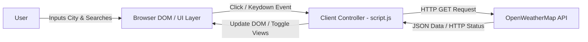

# Architecture Documentation

## Overview

The Weather Application is a lightweight, single-page client-side web application that provides real-time weather information for user-specified cities. It fetches weather data directly from the OpenWeatherMap REST API and dynamically updates the user interface without requiring full page reloads or backend server processing.

## Architectural Approach & Core Technology

- **Architecture Style**: Single-Page Client-Side Web Application (SPA).
- **Core Technologies**: Standard HTML5, CSS3 (Flexbox & Glassmorphism), Vanilla JavaScript (ES6+ `async/await` and Fetch API).
- **Integration Pattern**: Directly consumes external RESTful JSON APIs from the browser.

## System Architecture Diagram

## Component & Module Responsibilities

### 1. Presentation Layer (`index.html` & `styles.css`)
- **`index.html`**: Defines the structural markup, including the search input field, action button, error message banner, and weather results container (temperature, city, humidity, wind speed, and climate icons).
- **`styles.css`**: Manages visual presentation and layout, applying responsive CSS Flexbox styles, backdrop blur glassmorphism effects, and media queries for mobile viewports.

### 2. Client Controller (`script.js`)
- **Event Handling**: Listens for click events on the search button and `Enter` keypress events within the text input field.
- **API Integration**: Formulates RESTful HTTP GET requests to OpenWeatherMap with metric units and user-supplied query parameters.
- **State & View Management**: Evaluates HTTP response status codes (`404` vs `200 OK`) to toggle display states between the error view (`.error`) and results view (`.result`).
- **DOM Manipulation**: Parses JSON payloads and extracts metrics (`temp`, `humidity`, `wind.speed`, `weather[0].main`), updating DOM node text contents and image sources (`./imgs/{weather}.png`).

## System & Data Flows

1. **User Request**: The user enters a city name into the input field (`.search-bar`) and presses Enter or clicks the search button (`.search-button`).
2. **Fetch Execution**: `getWeather(city)` invokes `fetch()` to query `https://api.openweathermap.org/data/2.5/weather?&units=metric&q={city}&appid={apiKey}`.
3. **Response Handling**:
   - **Error Flow (HTTP 404)**: Displays the `.error` DOM element (`display: block`) and hides the `.result` view (`display: none`).
   - **Success Flow (HTTP 200)**: Hides the error banner, displays `.result`, parses the JSON body, rounds the temperature, maps humidity and wind speed values, converts the primary weather condition to lowercase, and sets the local climate image asset path (`./imgs/{weather}.png`).

## External Systems & Dependencies

- **OpenWeatherMap API**: External REST service providing weather metrics. Requests require an API key parameter (`appid`).
- **Google Fonts CDN**: Delivers external font families (`Noto Sans`, `Montserrat`, `PT Sans Narrow`) for consistent typography.

## Security & Runtime Environment

- **Execution Boundary**: Runs entirely within the client's web browser.
- **Credential Security**: The API key is embedded directly within client-side code (`script.js`), exposing it to client inspection. No backend proxy or server-side secret management is currently present in the architecture.